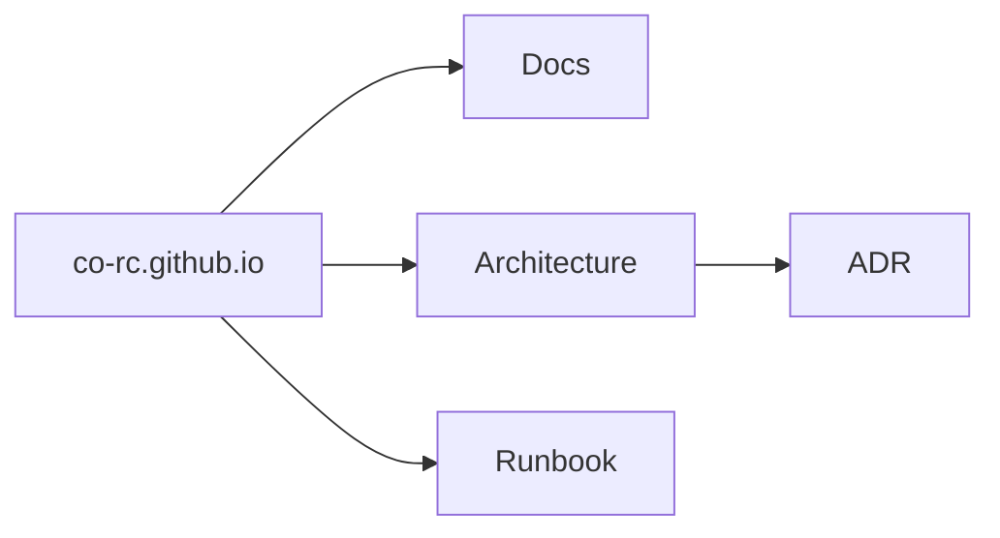

# ADR 0001: MkDocs + plugins

- Status: accepted
- Date: 2025-12-23

## Context

I need a public documentation site for the organization with:

- Markdown authoring
- Mermaid diagrams
- Fast onboarding and minimal toolchain

## Decision

Use:

- MkDocs
- GitHub Actions deployment to GitHub Pages
- Material for MkDocs
- Material
- PyMdown

## Consequences

- Documentation lives centrally in `co-rc.github.io`.
- Diagrams are authored as Mermaid fenced blocks.
- Builds run in CI; local preview is optional (`mkdocs serve`).
- Footer "Made with Material for MkDocs" is disabled for a cleaner look.
- Custom footer with copyright notice and organization GitHub link is added.

## Notes

PyMdown additions

---

### mermaid (pymdownx.superfences)



---

### pymdownx.tasklist

* [x] Lorem ipsum dolor sit amet, consectetur adipiscing elit
    * [x] Nulla lobortis egestas semper
* [ ] Curabitur elit nibh, euismod et ullamcorper at, iaculis feugiat est

---

### pymdownx.critic

{-- Deleted --} {++ Added ++} {~~ Substituted ~> New Value ~~} {== Mark ==} {>> Comment <<}

---

### pymdownx.details

???+ warning "Remember to add empty line to avoid IntelliJ reformatting"
    
    also remember that two trailing spaces are rendered as `<\br>`

??? info "Details: press the right arrow to expand"

    Remember to add empty line to avoid IntelliJ reformatting  
    Lorum ipsum.

---

### pymdownx.inlinehilite

The `#!python range()` function is handy.

---

### pymdownx.emoji

:heart: :fontawesome-solid-rocket: :material-rocket: :octicons-rocket-16:

---

### pymdownx.magiclink + pymdownx.saneheaders

```text
- Issue:   #1
- Issue:   co-rc.github.io#1
- Issue:   device-pico2040w-example#1
- Issue:   remote-android#1
- PR:      !1
- SHA:     0a17e8e1af6ac07cae73f27877eac9e744f3e6f2
- Mention: @jbanaszczyk
- Mention: @co-rc/remote-android
```

- Issue: #1
- Issue: co-rc.github.io#1
- Issue: device-pico2040w-example#1
- Issue: remote-android#1
- PR:    !1
- sha:   0a17e8e1af6ac07cae73f27877eac9e744f3e6f2
- Mention: @jbanaszczyk
- Mention: @co-rc/remote-android

---

### pymdownx.smartsymbols

(c) (r) (tm) +-

---

### pymdownx.mark

==highlight==

---

### def_list

Term 1
:   Definition 1

Term 2
:   Definition 2

---

### admonition

!!! note

    This is a note.

!!! abstract

    This is an abstract.

!!! info

    This is an info block.

!!! tip

    This is a tip.

!!! success

    This is a success block.

!!! question

    This is a question block.

!!! warning

    This is a warning.

!!! failure

    This is a failure block.

!!! danger

    This is a danger block.

!!! bug

    This is a bug block.

!!! example

    This is an example block.

!!! quote

    This is a quote block.

---

### pymdownx.progressbar

[= 0% "0%"]
[= 25% "25%"]
[= 50% "50%"]
[= 75% "75%"]
[= 100% "100%"]
