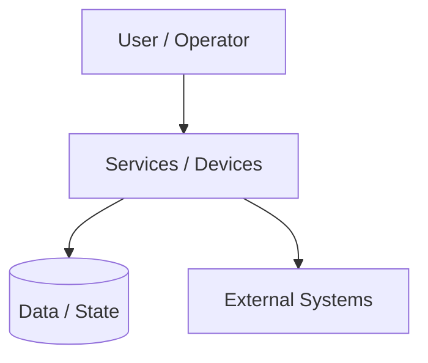

# Architecture

High-level view and long-lived decisions.

## System overview (example)

```mermaid
flowchart TB
  U[User / Operator] --> S[Services / Devices]
  S --> D[(Data / State)]
  S --> X[External Systems]
```

## Decisions

See ADRs for decisions that are expensive to rediscover.
