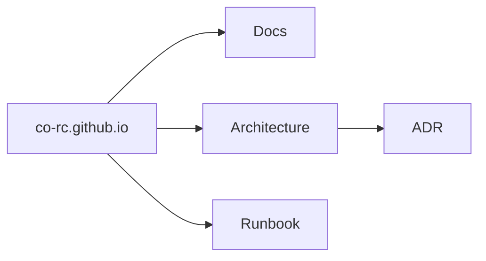

# co-rc

This is the organization documentation hub.

## Projects

- Add links to your repositories here (what they do, in one line).
- Keep detailed technical docs in the repos if you want, but this site is for cross-cutting notes.

## How this site is organized

- **Docs**: common conventions and shared notes
- **Architecture**: diagrams and ADRs (decisions)
- **Runbook**: operational recipes and troubleshooting

